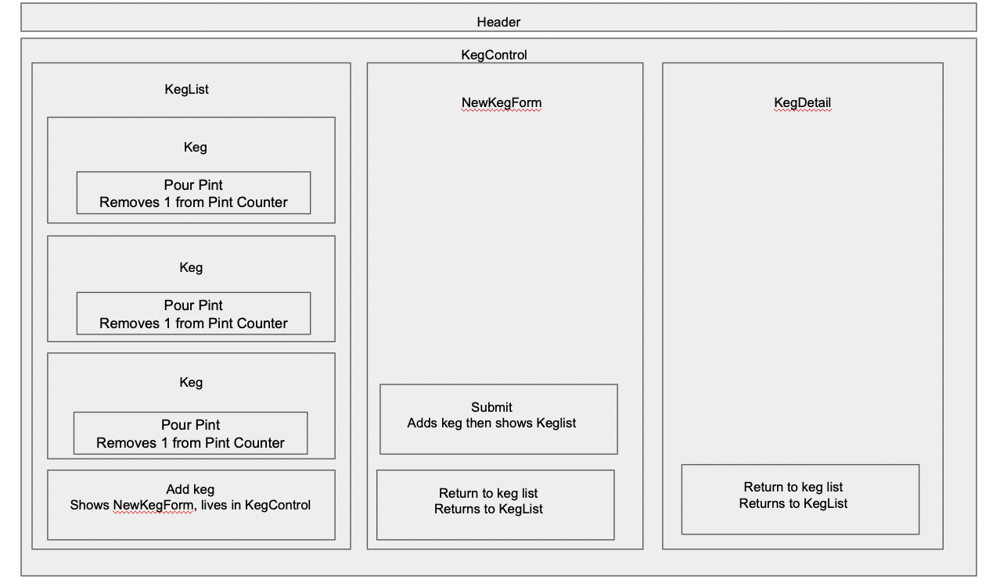

# _Tap Room App_

#### By _**Gabe Nielsen**_

#### _This is the bones of a react app that lets a user add and track kegs._

## Technologies Used

- _React_
- _JavaScript_
- _HTML_
- _CSS_

## Description

_This is a React app that tracks kegs. When a user clicks to add a keg, they will be asked for information about the keg. The keg is then added to the list to be tracked. A user can then click on the keg tab to see all it's information, or press the button to pour a pint. This will decrease that pints left count. This is solely a front end project, so there is no storage of information and it will get lost on a page refresh._

## Components

## Setup/Installation Requirements

- _Clone this repository_
- _Navigate to the root directory in the terminal_
- _Run `npm install`_
- _Run `npm start`_

## Known Issues

- _Any time the page switches state, the pint counter resets. I suspect it is because the count state is on Keg. It may have to move up a level to KegList._

## License

Copyright (c) _2022_ _Gabe Nielsen_
